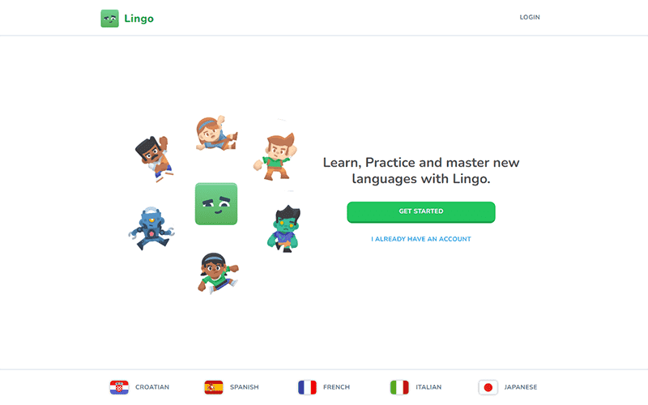
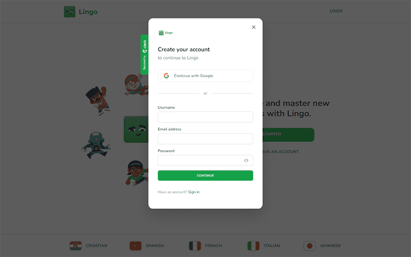
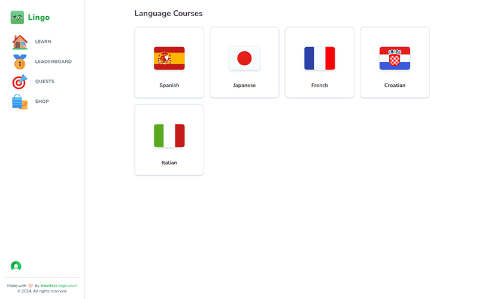
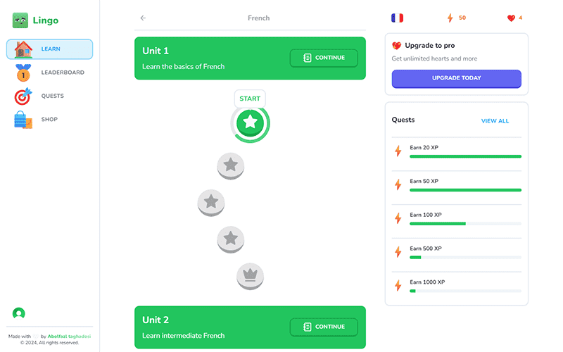
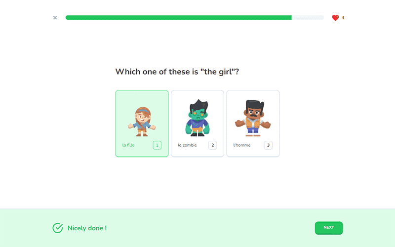
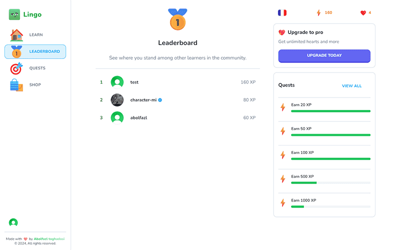
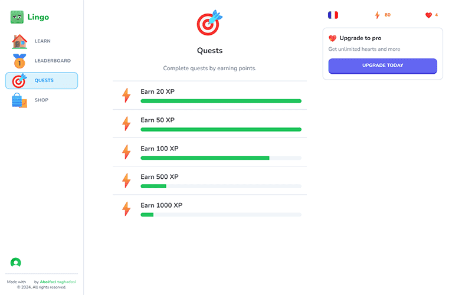
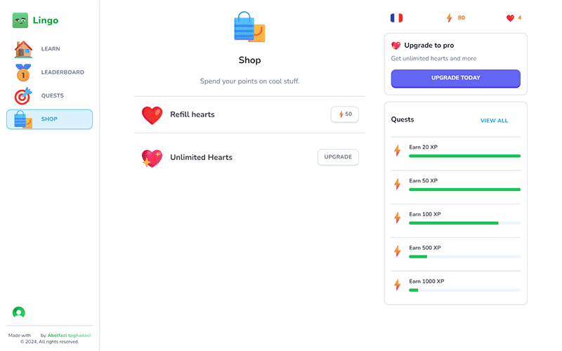
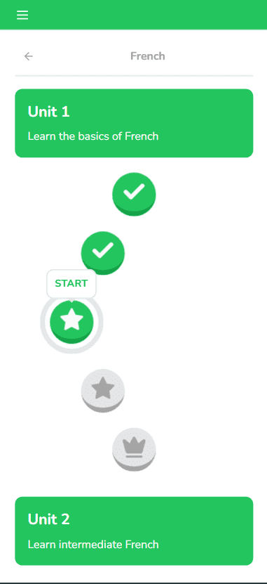

# 🌐 Lingo (duolingo clone)

### I've developed a web application called Lingo, which is a language learning program. Here are its features: the ability to select a course and learn from it, the option to continue a lesson from where you left off, an engaging user interface, a leaderboard page showcasing the top ten language learners, and a missions page displaying missions along with their completion status. We also have a system of hearts: with each incorrect answer, you lose hearts, and if you run out, you can't continue. You can regain hearts by purchasing them from the store using points earned or by revisiting completed lessons and answering questions correctly to earn hearts. Additionally, we offer the option to purchase a premium account where hearts become unlimited, ensuring uninterrupted learning even with mistakes. With Lingo, language learning becomes an exciting and rewarding experience.(اگه ایران هستید از فیلترشکن استفاده کنید)

## Link 🔗 [https://charactermi-lingo.vercel.app](https://charactermi-lingo.vercel.app)

 

# Preview

 

# Mobile Responsive

# Technologies

 

<ul>
    <li>
        
    </li>
    <li>
        
    </li>
    <li>
        
    </li>
    <li>
        
    </li>
    <li>
        
    </li>
    <li>
        
    </li>
    <li>
        
    </li>
    <li>
        
    </li>
</ul>
